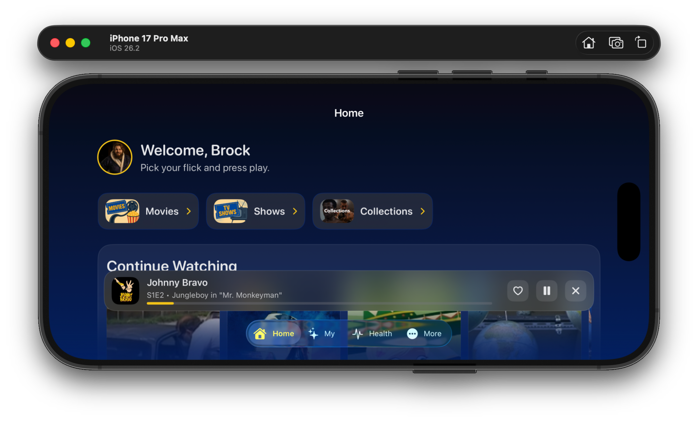
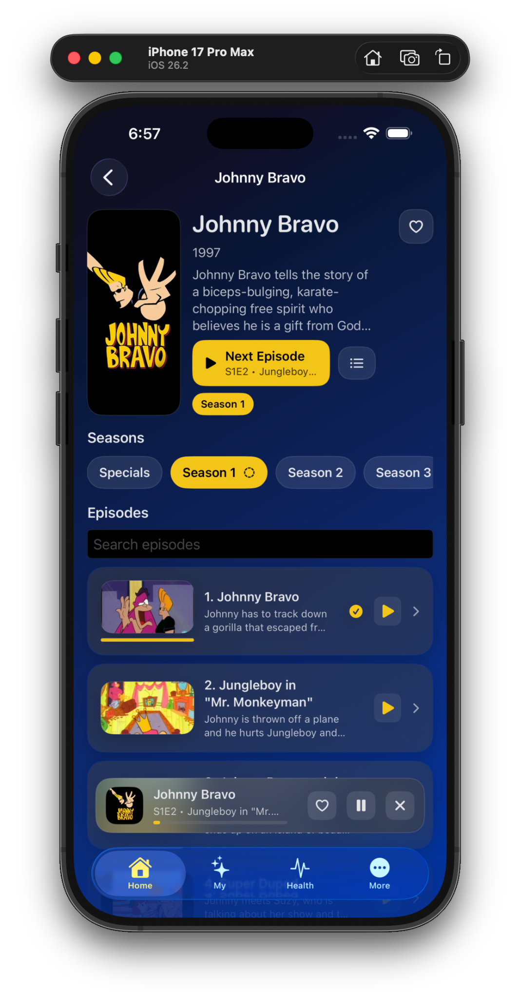
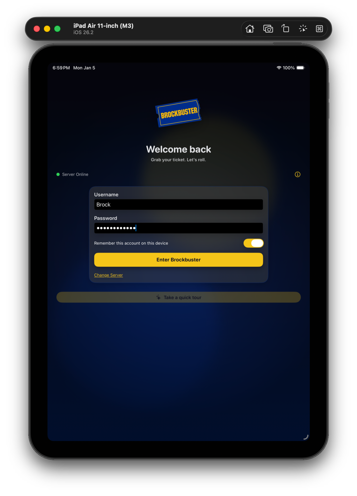
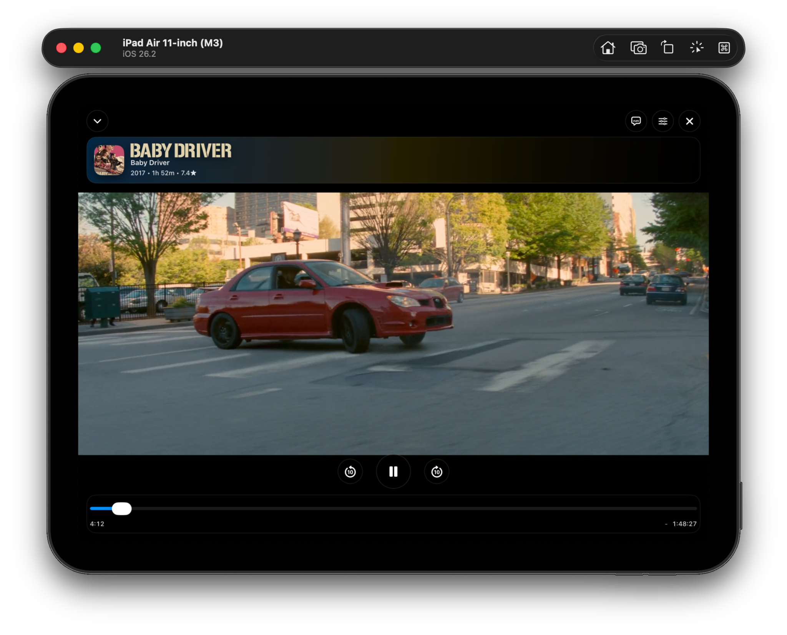
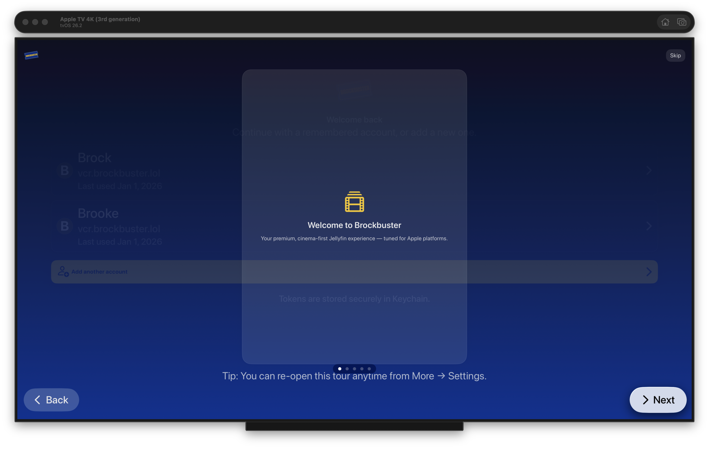

# Brockbuster

  

  <strong>A modern Apple-first Jellyfin client, wrapped in retro Blockbuster nostalgia.</strong>

  
  
  
  

---

## 📦 Version 0.1.0 — First Stable Release
---

This release marks the first **stable milestone** of Brockbuster.

Core Jellyfin functionality is implemented and usable across supported Apple platforms.  
While the project will continue to evolve, **this version is considered safe for regular use**.

---

## 🧭 Core Jellyfin Features

### Library Browsing
- Dedicated pages for **Movies**, **TV Series**, and **Collections**
- Full season & episode navigation
- Rich metadata views with artwork, descriptions, runtime, and year

### Playback & Streaming
- Automatic **Direct Play** when codecs are natively supported
- Intelligent **Transcoded stream fallback** when required
- Manual quality selection (Auto / 1080p / 720p / 480p)
- Skip Intro support (when available)
- Next Episode autoplay for TV series

### Watch State
- Continue Watching
- Watch History
- Resume playback across devices
- Favorites for Movies and TV Series

---

## 📥 Offline Viewing

Offline playback is supported but still evolving.

- Download media directly to your device
- Choose between:
  - **Direct File Downloads**
  - **Server-side Transcoded Copies** (recommended for compatibility)
- Codec compatibility checks before download
- Download manager with progress tracking
- Fully offline playback with cached metadata & artwork

---

## ▶️ Custom Player Experience

- Fully custom SwiftUI-based player
- Native Apple playback controls
- Background audio support
- Mini **Now Playing** bar while browsing
- Dynamic Island & system media controls (where supported)

---

## 🌐 Brockbuster.lol Exclusive Features

These features are powered by the Brockbuster service layer and are **not part of Jellyfin itself**.

### Server Health Dashboard
- Real-time server status
- CPU, GPU, memory, and storage visibility
- Drive health warnings

### Social & Identity
- Brockbuster membership card
- Public user profiles (opt-in)
- Friends system
- Community discovery (People directory)

---

## 🖥 Supported Platforms

- **iOS 26+**
- **iPadOS 26+**
- **macOS 15+**
- **tvOS 26+**

Built with SwiftUI for a consistent, native experience across all devices.

---

## ⚠️ Known Issues (0.1.0)

- **Offline downloads require polish**  
  Downloads may halt if the app is swiped away, and error handling can be inconsistent in some cases.

- **Next Episode metadata truncation**  
  When episodes auto-play, the player may fail to display the correct episode title, season number, or episode number.  
  This does not affect movies or the first episode played in a session.

- **UI clipping on Home screen**  
  Some text may render outside the visible area for TV Series or Episodes in Continue Watching or TV listings.

- **Additional bugs may exist**  
  As this is the first stable release, further issues may surface with broader usage.

---

## ℹ️ Notes

- Brockbuster is **not affiliated with Blockbuster LLC**
- Designed for personal and community use with **self-hosted Jellyfin servers**
- App Store distribution is not planned; TestFlight is used for iOS, iPadOS, and tvOS

---

© Brock Sexton

## 🐞 Bug Reporting
Users can report issues via:
- **More → Settings → Report a Bug**
- **Shaking their iPhone**, which prompts a bug report flow

## Screens

